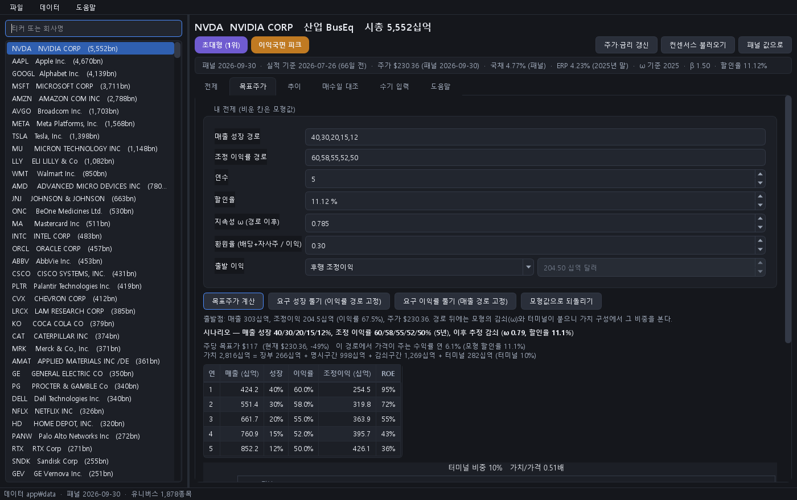
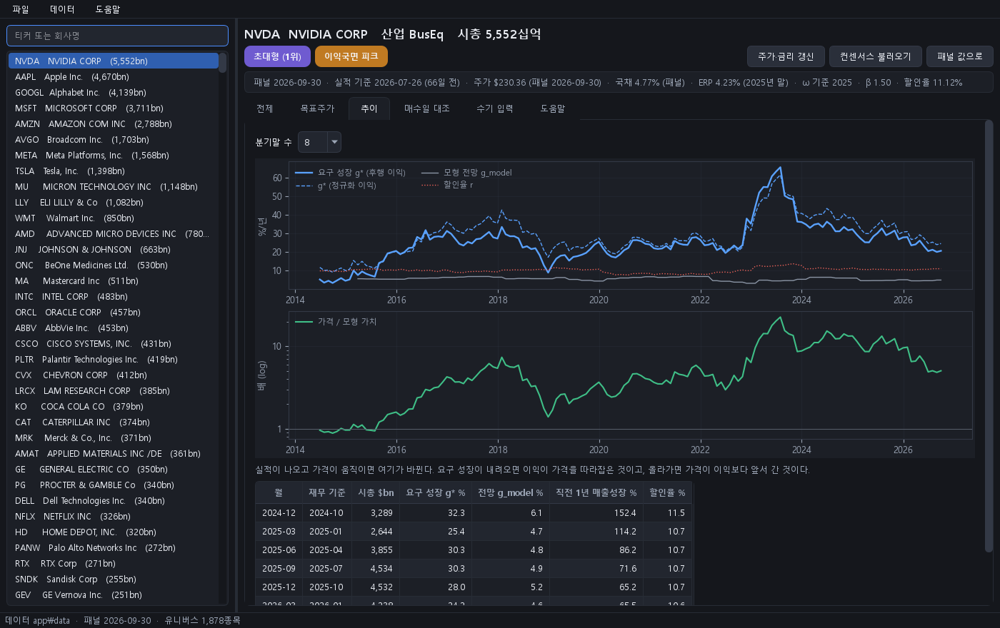

# 구조적 적정가치 (SFV) — 가격이 전제하는 가정을 읽는 도구

미국 비금융 상장사 약 1,900곳에 대해 **지금 주가가 성립하려면 앞으로 10년간 이익이 매년 몇 %씩 자라야 하는지**를 역산하고, 그런 성장이 과거에 얼마나 흔했는지를 나란히 보여 주는 도구입니다. 데이터는 전부 무료 공개 자료(SEC XBRL·13F·N-PORT·FTD, FRED, Damodaran)이고, 모든 계산은 그 시점에 공개돼 있던 값만 씁니다(point in time).

[English summary](README_EN.md) · 튜토리얼 [`TUTORIAL.md`](TUTORIAL.md) · 현재 사양 [`FRAMEWORK.md`](FRAMEWORK.md) · 결과 색인 [`reports/INDEX.md`](reports/INDEX.md)

## 1. 가치평가 프레임워크

### 1.1 출발점 — 잔여이익모형

가치는 장부가에 초과이익의 현재가치를 더한 것입니다.

```
V_t = B_t + Σ_{k=1..10} (ROE_k − r) · B_{k−1} / (1+r)^k + TV
```

B는 무형자산을 조정한 장부가, ROE_k는 k년째 조정 ROE, r은 자본비용, TV는 10년 뒤 남는 초과이익의 터미널 가치입니다.

DCF 대신 이 형태를 쓰는 이유는 정확도가 아니라 **가정이 놓이는 자리**입니다. 청산잉여관계가 성립하면 두 모형의 이론값은 같습니다. 그런데 DCF는 10년 뒤 터미널이 가치의 60~80%를 차지하고 그 몫이 터미널 성장률 하나로 정해집니다. 잔여이익모형은 관측된 장부가에서 출발하므로, 가정이 필요한 부분이 "지금의 초과수익성이 얼마나 오래 가느냐" 하나로 좁혀집니다. 그 하나를 가정하지 않고 데이터에서 추정하는 것이 이 프레임워크의 핵심입니다.

### 1.2 장부와 이익을 고쳐 쓴다 — 무형자산 자본화

회계는 R&D와 판관비를 그해 비용으로 지웁니다. 그래서 무형자산에 투자하는 기업일수록 장부가는 작고 ROE는 부풀려집니다. R&D 전액과 판관비 일부를 자산으로 올리고 매년 상각합니다(영구재고법). 세 파라미터는 Ewens·Peters·Wang(Management Science 2025)이 인수 가격으로 식별한 산업별 추정치입니다.

| 산업 (FF5) | R&D 상각률 | 판관비 중 자본화 몫 | 조직자본 상각률 |
|---|---|---|---|
| 제조 | 50% | 21% | 20% |
| 소비재 | 43% | 20% | 20% |
| 하이테크 | 42% | 37% | 20% |
| 헬스케어 | 33% | 51% | 20% |
| 기타 | 35% | 22% | 20% |

조정 장부가 B_adj = B + 무형자본, 조정 이익 E_adj = E + 당기 자본화 − 상각. 이 조정은 이론 가치를 바꾸지 않습니다. 바꾸는 것은 ROE의 뜻이고, 다음 단계의 지속성을 그 ROE로 추정하기 때문에 중요합니다.

### 1.3 감쇠 속도를 가정하지 않고 추정한다 — 지속성 ω

초과 ROE를 x = 조정 ROE − 산업 중앙값 ROE로 두고, 앞으로의 경로를 x_k = x_∞ + ω^k (x_0 − x_∞)로 씁니다. ω가 클수록 지금의 초과수익성이 오래 갑니다. 이 ω와 장기 수준 x_∞를 기업 특성별로 패널 회귀에서 추정합니다.

```
x_{t+1} = a + (ω_0 + ω'z) · x_t + γ'z + e
z = 무형집약도, R&D 집약도, 매출총이익률 안정성, 규모, 연령, 산업집중도, 음의 초과 ROE 더미, 시총 상위 20%·5% 더미
```

결과 연도까지의 자료만으로 적합하는 확장 윈도우이고, 추정치는 그 다음 해 6월 30일부터 씁니다. 추정된 지속성은 유니버스 동일가중 0.56, 시총 상위 5% 기업 0.84 수준입니다. 감쇠 목표는 산업(FF12) 중앙값 ROE이고, 자본비용까지 내려가는 고전적 대안을 하한으로 함께 봅니다.

### 1.4 할인율과 경계값

할인율은 10년 국채 + β × ERP입니다. ERP는 Damodaran의 전년 말 내재 ERP, β는 60개월 회귀를 0.5~1.5로 자른 값입니다. 장부가는 청산잉여관계로 자랍니다. 장부 성장 = ROE × (1 − 환원율), 환원율은 최근 4분기의 (배당 + 자사주매입 − 발행) / 조정 이익.

경계값: ω ≤ 0.90, 장기 초과 ROE ±10%p, 초기 초과 ROE ±50%p, 장부 성장 ≤ 25%/년, 터미널 성장 ≤ 4%. 이 경계가 없으면 가치가 폭발합니다. 대가로 슈퍼스타 기업은 체계적으로 낮게 평가되며, 그래서 다음 단계가 필요합니다.

### 1.5 거꾸로 푼다 — 가격이 요구하는 것

모형 가치가 가격과 다를 때 가격이 틀렸다고 보지 않습니다. 대신 **가격이 맞으려면 어떤 가정이 참이어야 하는가**를 풉니다. 다른 입력은 모형값에 고정하고 하나만 풀어 가치 = 가격이 되는 값을 찾습니다.

| 역산값 | 뜻 |
|---|---|
| 요구 성장 g* (10년) | 10년간 매년 g씩 이익이 자라고 그 뒤 기존 감쇠를 따를 때 가치 = 가격이 되는 g. 헤드라인 숫자 |
| 요구 지속성 ω* | 지금의 초과수익성이 어느 속도로 유지돼야 가격이 맞는가. 반감기로 읽음 |
| 요구 유지 기간 T* | 지금의 초과 ROE가 몇 년 그대로 유지돼야 가격이 맞는가 |
| g*의 구간 | 자본화 파라미터를 문헌의 여섯 조합으로 바꿔 다시 푼 g*의 하한과 상한 |
| 수익률 축 r*(g) | 가격 하나에 미지수는 성장과 요구수익률 둘. 성장 전망을 5~30%로 고정하고 그 가격이 주는 연 수익률을 푼 것 |
| 정규화 g* | 출발 이익을 5년 평균 이익률 × 현재 매출로 바꿔 다시 푼 g*. 후행 이익과 30% 넘게 다르면 이익 국면(피크·저점) 표시 |

역산값만으로는 판단할 수 없어 **기저율**을 붙입니다. 2014년 이후 모든 기업-분기에서 가격이 요구한 성장과 이후 3년의 실현을 대조한 것입니다.

| 가격이 요구한 성장 | 이후 3년간 달성한 비율 |
|---|---|
| 5~10% | 34% |
| 10~15% | 20% |
| 15~20% | 13% |
| 20~30% | 9% |
| 30~50% | 4% |
| 50% 초과 | 3% |

규모·산업·직전 성장·수익성이 비슷한 기업들의 조건부 달성 확률도 함께 냅니다. 직전 1년에 빠르게 자란 기업은 같은 요구 성장이라도 달성률이 두 배쯤 높습니다.

### 1.6 앞으로 푼다 — 내 전망이면 얼마인가

연도별 매출 성장과 조정 이익률 경로를 넣으면 이익 경로가 만들어지고, 그 뒤에 같은 감쇠와 터미널이 붙어 가치, 주당 목표가, 그 경로에서 가격이 주는 수익률, 그 속도로 자란 기업의 역사적 비율이 나옵니다. 적자 기업은 이익률 경로를 정하면 가격이 요구하는 매출 성장을 풀고, 매출 경로를 정하면 요구 이익률을 풉니다. 역산과 정방향은 같은 엔진이라, 요구 성장 g*를 10년 경로로 넣으면 목표가가 현재가와 같아집니다.

### 1.7 예시 — 엔비디아, 2026-09-30

```
python scripts/what_if.py --ticker NVDA
```

| 항목 | 값 |
|---|---|
| 가격이 요구하는 10년 이익성장 g* | 연 20.7% (자본화 가정을 바꿔도 20.1~21.5%) |
| 그 정도를 요구받은 기업이 이후 3년간 실제로 낸 비율 | 요구 20~30% 구간 전체 9%, 직전 1년에 이만큼 자란 무리 안에서는 21% |
| 내 성장 전망이 연 15%라면 이 가격이 주는 연 수익률 | 8.5% (20%면 10.8%) |
| 정규화 이익 기준 요구 성장 | 연 24.7%, 이익 국면 "피크" |

읽는 순서는 정해져 있습니다. 자기 요구수익률을 먼저 정하고, 가격이 요구하는 성장과 구간을 읽고, 그것이 과거에 얼마나 흔했는지 보고, 자기 성장 전망에서 가격이 주는 수익률을 요구수익률과 비교하고, 실적이 나오면 다시 읽습니다. 흑자 초대형주·적자 기업·매수일 대조 세 경우를 실제 출력으로 따라간 것이 [`docs/walkthrough.md`](docs/walkthrough.md)입니다.

## 2. 예측 검정 결과

이 도구는 **예측 모형이 아닙니다.** 구현 전에 고정한 기준으로 2014-06~2026-09 표본(13F 내재가격 분기 수익률, 상장폐지 포함, Fama-MacBeth)에서 검정한 결과, 아래 3절의 분해 성분 어느 것도, 벤치마크(B/M, E/P, Bartram·Grinblatt 동료내재가치, ICC)도 이후 수익률을 예측하지 못했습니다. 미리 정한 폐기 기준에 걸렸고 그대로 기록했습니다([`reports/phase3_validation.md`](reports/phase3_validation.md), 기준은 [`docs/design_spec_20260905.md`](docs/design_spec_20260905.md) 2.5절).

그래서 이 도구로 초과수익을 노리지 않습니다. 쓸모는 다른 데 있습니다. 가격에 깔린 성장 가정을 숫자로 꺼내 보고, 그 정도 성장이 과거에 얼마나 실현됐는지 견주고, 실적이 나온 뒤 그 가정을 다시 채점하는 것입니다. 그 가정을 믿을지는 쓰는 사람이 정합니다.

## 3. 시스템 구성

**데이터.** SEC XBRL companyfacts(재무, 2009~), 13F(기관 보유, 2013~), N-PORT(펀드 보유·유출입, 2019~), FTD(상장폐지 종목 가격), yfinance(월말 가격·분할·컨센서스), FRED(국채), Damodaran(ERP). 재무는 최초 보고치만 공시일 이후에 쓰고, 13F는 분기말 + 46일부터, 지속성 추정치는 다음 해 6월 30일부터 씁니다. 검증 수익률은 13F 내재가격으로 만들어 상장폐지 종목을 포함합니다(yfinance와 상관 0.996). 유니버스는 미국 비금융 보통주, 시총 3억 달러 이상, 월별 약 1,400~1,900종목.

**가격 분해(진단용).** log(가격/가치)를 월별 횡단면 회귀로 나눕니다.

```
log(P/V) = δ_S(구조적 수요) + δ_T(일시 수급) + δ_F(모형보정 특성) + δ_M(모멘텀) + δ_E(펀더멘털 기대) + 산업 + ε
```

ε은 동료·특성 대비 상대 프리미엄입니다. 2절의 검정은 이 성분들에 대한 것이고, 초대형주에서는 방향조차 없습니다. 그래서 분해는 진단에만 쓰고 판단은 1절의 역산으로 합니다.

**도구.** 데스크톱 계산기(PySide6, 탭 여섯: 전제·목표주가·추이·매수일 대조·수기 입력·도움말)와 명령줄 `scripts/what_if.py`는 같은 계산 라이브러리 `sfv/calc.py`를 씁니다. 데이터 품질 불변식 37개(키 유일성·시점 규칙·항등식·값 범위·입력 신선도)가 매 실행마다 돌고, `run_sfv.py`가 파일 의존성을 보고 오래된 단계만 다시 계산합니다.

**화면.** 전제 탭은 맨 위에 기호 없는 요약 문장, 아래에 판단에 쓰는 두 줄과 수익률 축을 두고 나머지 지표는 접어 둡니다.


목표주가 탭(내 경로 → 주당 목표가·수익률·가치 구성)과 추이 탭(요구 성장이 분기마다 어떻게 움직였나). 목표주가 화면의 경로(매출 성장 40→12%, 이익률 60→50%)는 입력 예시일 뿐 견해가 아닙니다.





전체 흐름을 한 장으로 그린 것이 [`docs/img/sfv_structure.png`](docs/img/sfv_structure.png), 수식까지 담은 포스터가 [`docs/img/sfv_framework.png`](docs/img/sfv_framework.png)입니다.

## 4. 바로 실행

클론 직후 계산기와 명령줄이 돕니다. 최신 월의 축약 테이블(`app/data/`, 19MB)이 저장소에 들어 있기 때문입니다. 전체 파이프라인 재계산에는 약 17GB의 원본이 필요하고 [`data/README.md`](data/README.md)에 입수 방법이 있습니다.

```bash
pip install -r requirements.txt            # Python 3.11
python -m app                              # 데스크톱 계산기
python scripts/what_if.py --ticker NVDA    # 한 종목의 역산·수익률 축·추이
python scripts/what_if.py --ticker IREN --solve-growth --margin 30,35,40 --years 5   # 적자 기업: 이익률 경로 → 요구 매출 성장
python scripts/what_if.py --ticker AAPL --since 2024-12-31                          # 매수일의 전제 vs 이후 실현
python -m pytest tests -q                  # 단위 테스트
python app/selftest.py                     # 계산기 자체 점검 (화면 없이)
```

## 5. 저장소 구조

| 경로 | 내용 |
|---|---|
| `sfv/` | 파이프라인 모듈 28개. 원본 파싱(`xbrl_extract`, `f13`, `nport`, `ftd`) → 패널(`xbrl_panel`, `universe`) → 가치(`intangibles`, `persistence`, `rim`, `growth_rim`) → 분해·검증(`demand`, `decompose`, `validate`) → 역산(`implied`, `expectations`) → 계산 라이브러리(`calc`, `store`, `live`) → 점검·출력(`selfcheck`, `report`) |
| `app/` | 데스크톱 계산기. `app/data/`는 최신 월 축약 테이블 |
| `scripts/` | 분석 스크립트와 명령줄 도구 `what_if.py`, 구조도·포스터 생성기 |
| `run_sfv.py` | 월별 갱신 실행기 |
| `tests/` | 단위 테스트(분기 흐름 복원, N-PORT 단위 보정, 증권 분류) |
| `reports/` | 단계별 결과 리포트 30여 개, 종목별 표(`sfv_report.html`, `sfv_latest.csv`), 데이터 점검(`selfcheck.md`), 코드 리뷰 기록 |
| `docs/` | 코드↔산출물 대응(`CODE_MAP.md`), 설계 명세와 사전 등록 기준(`design_spec_20260905.md`), 워크스루, 이미지 |
| `FRAMEWORK.md`, `TUTORIAL.md` | 현재 사양(수식·데이터 규칙·검증 위계·한계), 기초 개념부터의 튜토리얼 |

## 6. 읽는 순서

1. 이 문서와 [`docs/walkthrough.md`](docs/walkthrough.md)
2. [`TUTORIAL.md`](TUTORIAL.md) — 현재가치와 DCF의 문제에서 시작해 잔여이익모형, 감쇠, 무형자산, 역산까지
3. [`FRAMEWORK.md`](FRAMEWORK.md) — 수식과 데이터·시점 규칙, 검증 체계, 원안 대비 변경 이력
4. [`reports/INDEX.md`](reports/INDEX.md) — 단계별 결과와 판정
5. [`docs/CODE_MAP.md`](docs/CODE_MAP.md), [`docs/design_spec_20260905.md`](docs/design_spec_20260905.md)

## 7. 한계

- 예측 모형이 아닙니다. 표본은 12년, 한 번의 강세장입니다.
- 경계값은 가치 폭발을 막는 대가로 슈퍼스타를 체계적으로 낮게 평가합니다. 그래서 초대형주는 점 추정 가치가 아니라 역산값으로 읽습니다.
- 자본화 파라미터를 바꾸면 종목 가치는 중앙값 46% 움직입니다. 상대 순위(순위상관 0.92~0.98)와 요구 성장 구간은 안정적이라 판단은 점이 아니라 구간으로 합니다. 구간은 초대형주에서 좁고 소형주에서 넓습니다.
- 금융업 제외. 외국 법인의 IFRS 공시 기간은 파싱되지 않습니다. 장부가 음수인 기업은 평가할 수 없습니다.
- 회사를 아는 일(제품·경쟁·경영진)은 도구 밖입니다.

## 8. 작업 방식

2026년 9월 약 2주. 설계 명세를 쓰고 판정 기준을 구현 전에 고정한 뒤, 데이터 파이프라인부터 도구화까지 단계마다 결과 리포트를 남기며 진행했습니다. AI 코딩 보조 도구(Claude Code)를 사용했고, 모형과 방향의 결정은 제가 했습니다. 잔여이익모형과 로그 항등식 채택, 산업별 무형자산 자본화, 감쇠 목표를 산업 중앙값으로 두고 자본비용 대안을 하한으로 함께 보고, 사전 등록 기준과 폐기 판정의 수용, 수요 성분의 유지, 예측 검정을 월별 실행에서 분리, 역산을 주 용도로 전환, 초대형주 결론을 소형주로 일반화하지 않는 구간 규칙, 데스크톱 계산기의 형태. 코드 리뷰와 그 과정에서 고친 결함, 한 번의 운영 사고 기록은 [`reports/code_review.md`](reports/code_review.md)에 있습니다.

## 라이선스

MIT. 데이터는 각 출처(SEC, FRED, NYU Stern Damodaran, Ewens·Peters·Wang)의 이용 조건을 따릅니다.
