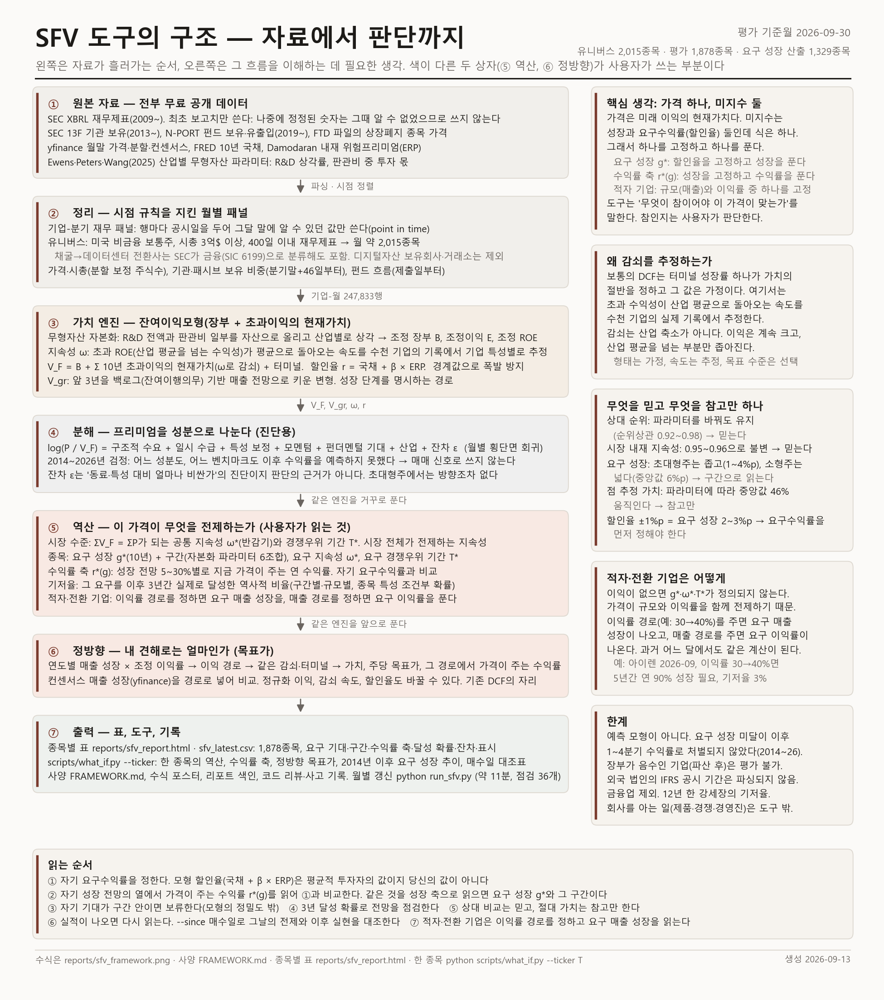
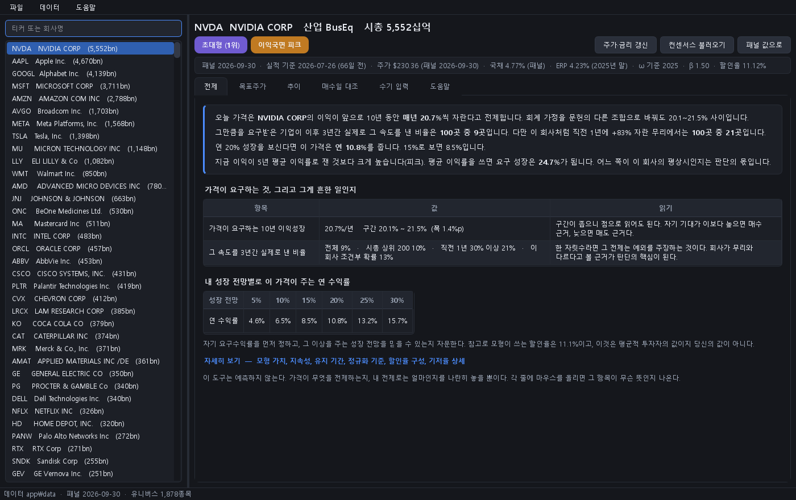

# Structural Fair Value (SFV) — reading what a price assumes

For about 1,900 US non-financial stocks, this tool inverts a residual-income valuation to answer one question: **how fast must earnings grow over the next ten years for today's price to be right?** It then shows how often firms asked for that much actually delivered it. Every input is free public data (SEC XBRL, 13F, N-PORT, FTD, FRED, Damodaran), and every calculation uses only what was public at the time (point in time).

The full documentation is in Korean: [`README.md`](README.md), [`TUTORIAL.md`](TUTORIAL.md) (concepts from present value to the inversion), [`FRAMEWORK.md`](FRAMEWORK.md) (current specification), [`reports/INDEX.md`](reports/INDEX.md) (results). Code comments and module docstrings are in English.



## What is here

- **Valuation engine.** Residual income model (book value plus the present value of excess earnings). R&D and part of SG&A are capitalised with industry-level parameters (Ewens, Peters and Wang 2025), and the speed at which excess ROE fades to the industry median is not assumed but estimated per firm from a panel regression on thousands of firms' histories.
- **Decomposition.** log(price / value) is split each month, cross-sectionally, into structural demand (institutional and passive ownership), transient flow (fund flows), momentum, fundamental expectations, industry, and a residual. Diagnostic only.
- **Inversion and forward mode.** The same engine solved backwards gives the growth g*, persistence ω* and excess-return horizon T* the price requires, with a band on g* from six capitalisation parameter sets in the literature. Solved forwards, a revenue-and-margin path gives a target price and the return the price offers. Loss makers: fix a margin path and solve for the required revenue growth.
- **Tooling.** A PySide6 desktop calculator and a command line, 37 data-quality invariants (key uniqueness, timing rules, identities, ranges, input freshness), and a dependency-aware monthly runner.

## The honest result

**This is not a return-prediction model.** Under a verdict rule fixed before implementation, none of the decomposition's components, and none of the benchmarks (B/M, E/P, Bartram–Grinblatt peer-implied value, ICC), predicted subsequent returns over 2014-06 to 2026-09 (13F-implied quarterly returns including delistings, Fama–MacBeth). The pre-registered rejection criterion was met and is recorded as such ([`reports/phase3_validation.md`](reports/phase3_validation.md); the criterion is in [`docs/design_spec_20260905.md`](docs/design_spec_20260905.md), section 2.5).

What remains is decision hygiene rather than alpha: translate what a price assumes into numbers, compare those assumptions with historical base rates, and score them once results come in. Whether to believe the assumptions is the user's call.

## Example — NVIDIA, 2026-09-30

```
python scripts/what_if.py --ticker NVDA
```

| | |
|---|---|
| Ten-year earnings growth the price requires, g* | 20.7% a year (20.1–21.5% across capitalisation assumptions) |
| Share of firms asked for 20–30% that delivered it over the next three years | 9% overall; 21% among firms that had just grown as fast as this one |
| Annual return the price offers if you expect 15% growth | 8.5% (10.8% at 20%) |
| g* on normalised earnings (five-year average margin) | 24.7%, flagged "peak" |

Three sentences: what growth does the price assume, how common has that been, and what return does my own forecast imply. A worked walkthrough with a profitable mega cap, a loss maker and a buy-date scorecard is in [`docs/walkthrough.md`](docs/walkthrough.md) (Korean).

## Screens



## Run it

The calculator and the command line work right after cloning, because the latest month's compact tables (`app/data/`, 19 MB) ship with the repository. Recomputing the full pipeline needs about 17 GB of raw public files; see [`data/README.md`](data/README.md).

```bash
pip install -r requirements.txt            # Python 3.11
python -m app                              # desktop calculator
python scripts/what_if.py --ticker NVDA
python scripts/what_if.py --ticker IREN --solve-growth --margin 30,35,40 --years 5
python scripts/what_if.py --ticker AAPL --since 2024-12-31
python -m pytest tests -q
```

## Layout

| Path | Contents |
|---|---|
| `sfv/` | 28 pipeline modules: raw parsing → point-in-time panel → valuation → decomposition and tests → inversion → shared calculation library → checks and report |
| `app/` | Desktop calculator (six tabs) and the compact data it reads |
| `scripts/` | Analysis scripts and the command-line tool `what_if.py` |
| `run_sfv.py` | Monthly runner that recomputes only stale stages |
| `tests/` | Unit tests on synthetic data |
| `reports/` | Thirty-odd stage reports, the per-stock table (`sfv_report.html`, `sfv_latest.csv`), data checks, code-review record |
| `docs/` | Code map, the original design spec with the pre-registered criterion, walkthrough, images |

## Data rules and limits

Fundamentals use first-reported XBRL values only, from their filing date; 13F holdings from quarter end + 46 days; persistence estimates from 30 June of the following year. Universe: US non-financial common stocks above $300m, roughly 1,400–1,900 names a month. Limits: not a prediction model; a twelve-year sample spanning one bull market; bounds that prevent value explosions also under-value superstars; capitalisation parameters move point values by a median 46% while ranks (rank correlation 0.92–0.98) and the g* band stay stable, so judgements are made on bands, not points.

## How it was built

About two weeks in September 2026: design spec, verdict rule fixed before implementation, then data pipeline to tooling with a written report at every stage. Built with an AI coding assistant (Claude Code); the modelling and direction decisions were mine. The code review, the defects it found and one operational incident are recorded in [`reports/code_review.md`](reports/code_review.md).

MIT licence. Data remain subject to their sources' terms.
